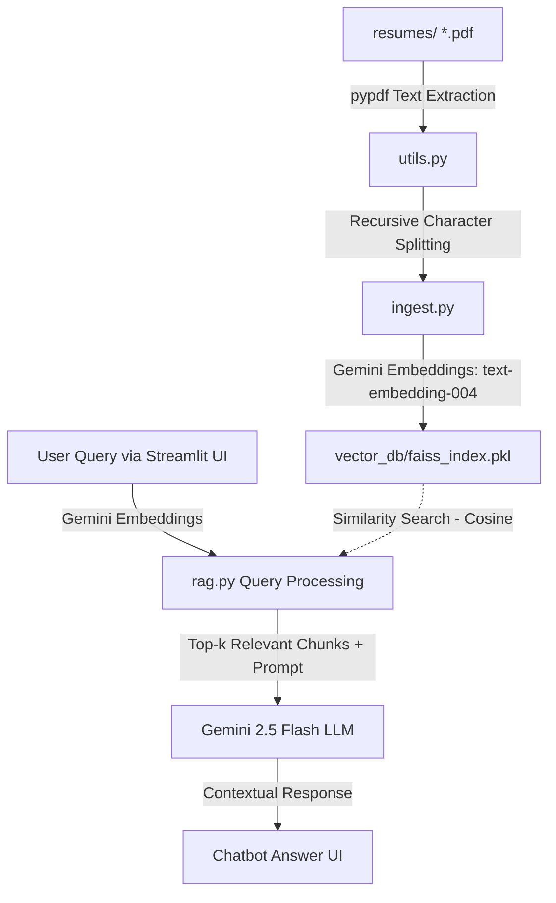

# Resume-RAG: AI-Powered Candidate Search Chatbot

A local Retrieval-Augmented Generation (RAG) system to index, search, and chat with candidate resume PDFs. Built using the Google GenAI SDK, FAISS vector search, and Streamlit.

---

## 🏗️ Architecture



---

## 🛠️ Features

- **Local Vector Database**: Fast vector similarity search using standard FAISS.
- **Advanced Text Splitting**: Custom recursive text splitter to preserve document layout and context.
- **Google Gemini Integration**: Powered by the brand-new `google-genai` SDK using `text-embedding-004` (for vector representations) and `gemini-2.5-flash` (for chatbot generation).
- **Interactive UI**: A sleek, premium dashboard built with Streamlit featuring real-time source retrieval display.

---

## 📂 Project Structure

```text
Resume-RAG/
│
├── app.py                # Streamlit UI & Chat Application
├── ingest.py             # Script to extract, embed, and store resume text
├── rag.py                # Query matching and LLM generation logic
├── utils.py              # PDF extraction and custom text splitter utility
│
├── resumes/              # Directory holding PDF resumes (e.g. pratik.pdf, amit.pdf, rahul.pdf)
├── vector_db/            # Local directory where FAISS index is serialized
│
├── requirements.txt      # Python dependencies
└── README.md             # Documentation
```

---

## 🚀 Setup & Execution

### 1. Clone the repository and navigate to the project directory:
```bash
cd Resume-RAG
```

### 2. Install dependencies:
We recommend using a virtual environment (e.g., `venv` or `conda`):
```bash
pip install -r requirements.txt
```

### 3. Configure Gemini API Key:
Create a `.env` file in the root of the `Resume-RAG/` directory:
```env
GEMINI_API_KEY=your_gemini_api_key_here
```
*(Alternatively, you can input the API key directly in the sidebar of the Streamlit application during runtime.)*

### 4. Build/Rebuild Vector Database:
Run the ingestion script to parse the mock resumes and create the FAISS index:
```bash
python ingest.py
```

### 5. Launch the Web Application:
Start the Streamlit development server:
```bash
streamlit run app.py
```
This will open the application in your default web browser (typically at `http://localhost:8501`).

---

## 📄 Included Candidate Resumes
The project includes three pre-generated mock resumes under `resumes/` representing different profiles:
- **Pratik Shinde**: Software Engineer (3+ years experience; React, Python, Django, AWS, Postgres)
- **Amit Sharma**: Data Scientist / ML Engineer (4 years experience; NLP, PyTorch, RAG/LLMs, FAISS)
- **Rahul Verma**: Product Manager (5+ years experience; Agile, Jira, roadmapping, SQL, analytics)
